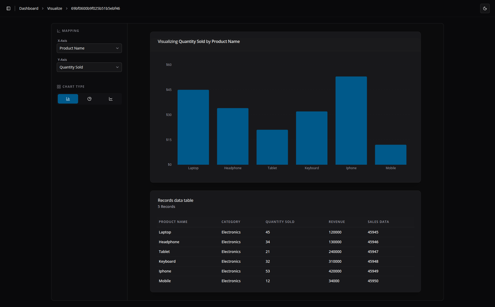
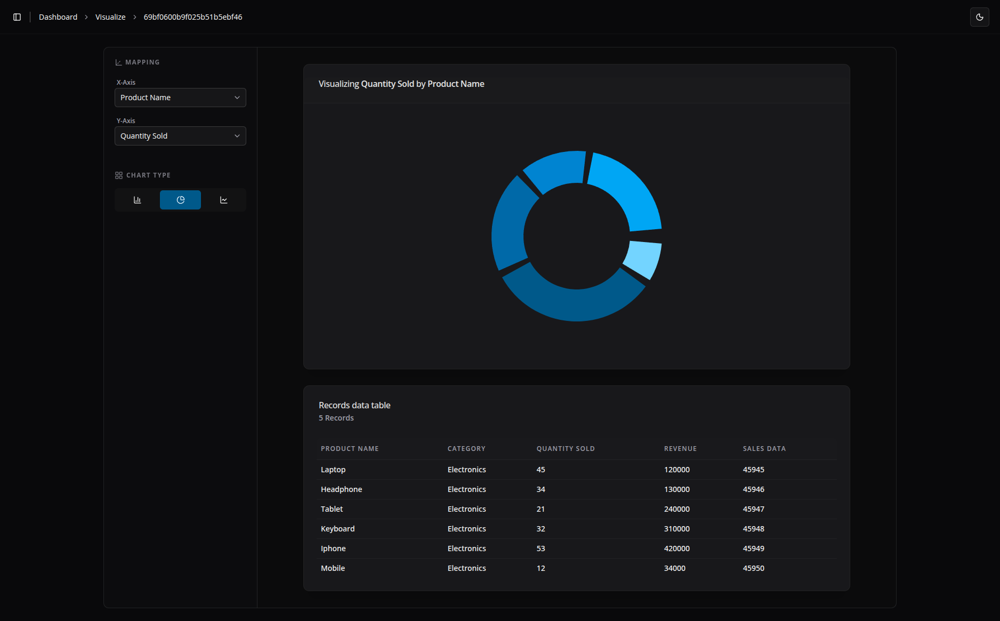
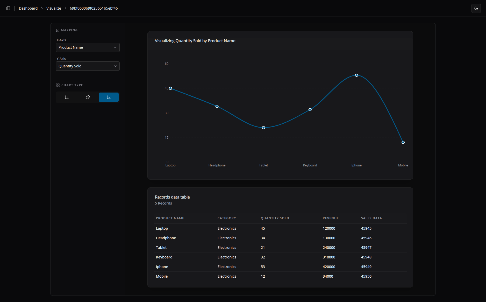
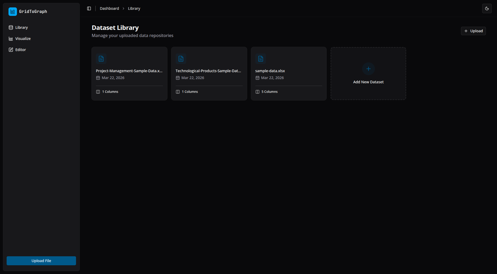
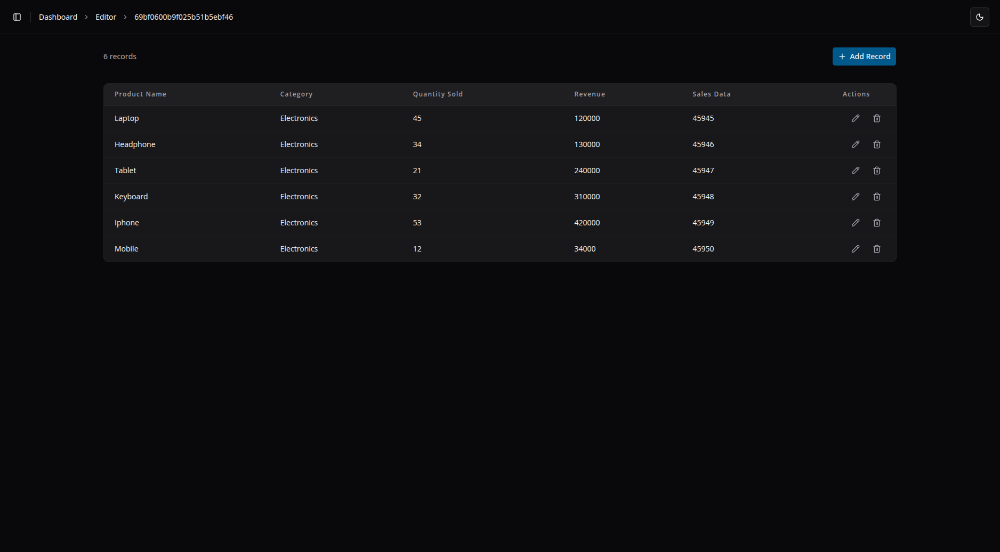

# Task GridToGraph

GridToGraph is a full-stack data visualization application designed to parse, manage, and visualize data from Excel spreadsheets. Built with a monorepo architecture using Turborepo, the application allows users to upload `.xlsx` files, manipulate records via a row-level editor, and extract insights through interactive charts.

The primary focus of this project is a clean, readable, and highly structured codebase. It utilizes **pnpm workspaces** and **pnpm catalogs** to ensure strict version matching for shared dependencies (e.g., Zod) across all applications and packages. **Biome** is configured globally for code formatting and linting.

## Architecture & Directory Structure

The repository is structured to separate shared logic from application-specific code:

- `packages/`: Contains shared libraries, Zod validations, and database configurations. Specifically, `packages/database` houses all schema definitions, ORM connections, and repository logic.
- `apps/`: Contains the core applications:
  - `api/`: Node.js & Express server.
  - `web/`: React client built with Vite.

### Backend Request Lifecycle (API)

The backend enforces a strict separation of concerns using a Controller-Service-Repository pattern:

1. **Middleware (**`validate-request`**)**: Intercepts the incoming client request and validates payload/parameters against shared Zod schemas.

2. **Controller**: Receives the validated request, handles the HTTP lifecycle, and manage the response.

3. **Service**: Contains the core business logic and processing tasks (e.g., parsing uploaded `.xlsx` files using the `xlsx(SheetJS)` package located in [`/apps/api/src/modules/dataset/dataset.service.ts`](https://github.com/sam4web/task-gridtograph/blob/main/apps/api/src/modules/dataset/dataset.service.ts)).

4. **Repository**: Invoked by the service layer to handle direct database access and manipulation.

## Dual-Database Approach

This project uses a dual-database architecture to satisfy strict user schemas while allowing flexibility for dynamic file uploads.

### 1. PostgreSQL (User Data)

PostgreSQL, interacted with via Drizzle ORM, handles structured user data and account management.

| Column     | Type        | Constraints      | Default             |
| ---------- | ----------- | ---------------- | ------------------- |
| id         | `uuid`      | Primary Key      | `gen_random_uuid()` |
| email      | `text`      | Not Null, Unique | —                   |
| password   | `text`      | Not Null         | Hashed string       |
| created_at | `timestamp` | Not Null         | `now()`             |
| updated_at | `timestamp` | Not Null         | `now()`             |
| last_login | `timestamp` | Nullable         | —                   |

### 2. MongoDB (Dataset Storage)

MongoDB, interacted with via Mongoose, stores the uploaded Excel data. Because spreadsheets lack a fixed schema, a NoSQL approach ensures the application can ingest and visualize highly variable datasets.

| Field     | Type       | Constraints       | Description                                  |
| --------- | ---------- | ----------------- | -------------------------------------------- |
| \_id      | `ObjectId` | Primary Key       | MongoDB internal unique ID                   |
| userId    | `string`   | Required, Indexed | Link to the user in PostgreSQL               |
| fileName  | `string`   | Required          | Original name of the Excel file              |
| columns   | `string[]` | —                 | Array of headers parsed from the spreadsheet |
| data      | `Mixed[]`  | —                 | Array of objects representing dataset rows   |
| createdAt | `date`     | Not Null          | Managed by Mongoose Timestamps               |
| updatedAt | `date`     | Not Null          | Managed by Mongoose Timestamps               |

_Example of an object within the `data` array representing a single spreadsheet row:_

```json
{
  "_id": "69bf0600b9f025b51b5ebf40",
  "Product Name": "Laptop",
  "Category": "Electronics",
  "Quantity Sold": "45",
  "Revenue": 120000,
  "Sales Data": 45945
}
```

## Core Features & Workflows

### Authentication Flow

The application implements JWT-based authentication for the protected `/dashboard` routes:

1. User logs in/registers; the server issues an **Access Token** (sent in the JSON response) and a **Refresh Token** (set as an `httpOnly` cookie).

2. The Access Token is stored strictly in memory (via Zustand) for immediate authorization and verification.

3. Upon page reload, the in-memory access token is cleared. The client automatically hits the `/api/auth/refresh` route with the `http-only` cookie to generate and issue a new access token.

### File Validation & Processing

File validation occurs at both the frontend and backend layers to ensure only structurally sound `.xlsx` files reach the parsing logic, preventing malformed data from corrupting the MongoDB collections.

### Frontend UI & Data Management

The frontend heavily utilizes **Shadcn UI** for modular, pre-built, and configurable components. Global state is split into two paradigms:

- **Zustand**: Manages global Auth state (`accessToken`, `persistLogin`, `userData`, `isAuthenticated`).

- **TanStack Query**: Handles asynchronous server state, specifically fetching, caching, and mutating dataset records.

### Routing & Views

- **Library (**`/dashboard/library`**)**: The central hub where users view all uploaded datasets and can delete files.

- **Redirection Logic**: The index pages (`/dashboard/visualizer/index.tsx` and `/dashboard/editor/index.tsx`) read from localStorage to automatically redirect users to their most recently opened dataset. If none is found, they are routed back to the Library.

- **Visualizer (**`/dashboard/visualizer/:fileId`**)**: Contains a dropdown selector to assign dataset columns to the X and Y axes. Users can toggle between Bar, Pie, and Line charts (powered by **Recharts**) to analyze data. A tabular view is rendered at the bottom for raw data inspection.

- **Editor (**`/dashboard/editor/:fileId`**)**: A dedicated interface handling CRUD operations, allowing users to manually add, update, and delete individual rows within a specific dataset.

## Tech Stack

### Frontend

- **Framework**: React (Vite)
- **Routing & Fetching**: TanStack Libraries
- **State Management**: Zustand
- **Visualization**: Recharts
- **Styling & Components**: Tailwind CSS, Shadcn UI

### Backend

- **Server**: Node.js, Express
- **Language**: TypeScript
- **Relational** DB: PostgreSQL, Drizzle ORM
- **NoSQL** DB: MongoDB, Mongoose
- **Architecture**: Turborepo (Monorepo)

## Setup & Installation

This project heavily relies on **pnpm workspaces** and **pnpm catalogs**. Ensure you have `pnpm` installed before proceeding.

1.  **Clone the repository:**

    ```bash
    git clone https://github.com/sam4web/task-gridtograph.git
    cd gridtograph
    ```

2.  **Install dependencies:**

    ```bash
    pnpm install
    ```

3.  **Configure Environment Variables:**

    Copy the .env.example files to create your local .env files:
    - Copy `apps/web/.env.example` to `apps/web/.env`
    - Copy `apps/api/.env.example` to `apps/api/.env`

4.  **Database Configuration:**

    In `apps/api/.env`, ensure you set your connection strings:
    - `DATABASE_URL` (PostgreSQL)
    - `MONGODB_URL` (MongoDB)

5.  **Run the application:**
    ```bash
    pnpm run dev
    ```

> ***Note**: This project is currently configured for a local development environment. While all core features are fully functional and stable, it has not yet been tested and configured for production release.*

## Screenshots

  
  
  
_Main visualize page showing the analytics overview and charts._

  
_The dataset library where uploaded files are managed and viewed._

  
_The editor page for performing manual CRUD operations on specific data rows._

## Project Links

- **Source Code**: [GitHub Repository](https://github.com/sam4web/task-gridtograph)

---
